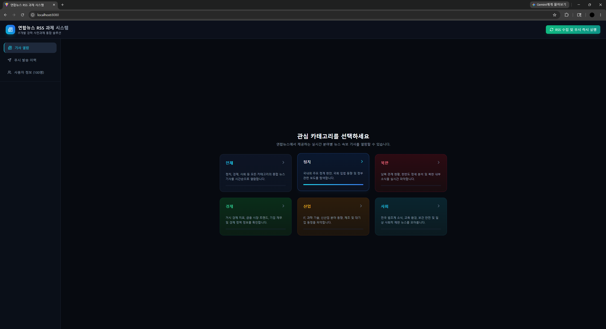
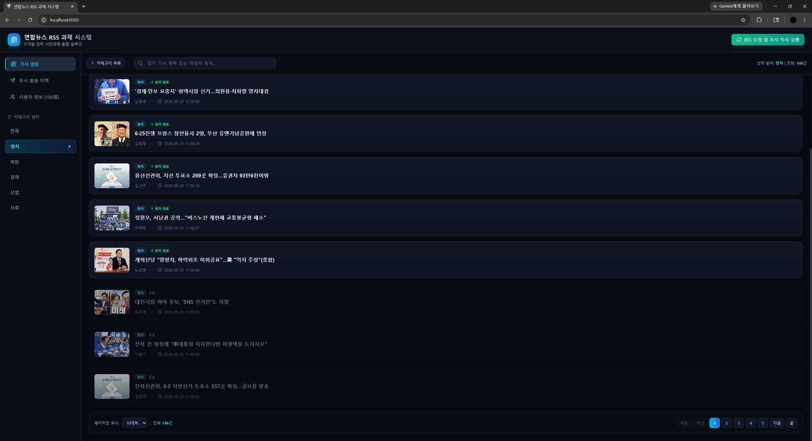
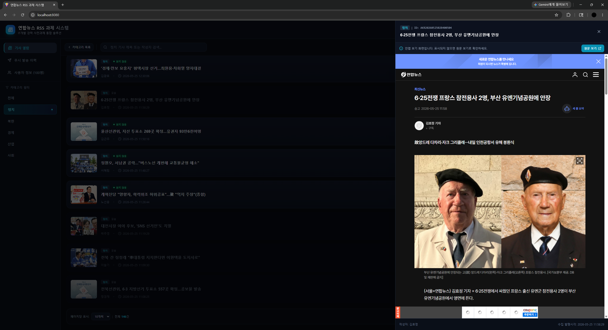

# 과제 1. 뉴스 기사 열람 웹 애플리케이션

## 1. 과제 목표

연합뉴스 RSS 데이터를 활용하여 사용자가 뉴스 기사를 카테고리별로 열람할 수 있는 웹 애플리케이션을 구현했습니다.

과제 요구사항에 맞춰 다음 기능을 제공합니다.

- 카테고리 선택
- 기사 리스트 표시
- 기사 본문 링크 제공
- 읽음/안 읽음 상태 표시
- 기사 검색 및 페이징
- API 오류 상태 표시

## 2. 화면 흐름

```text
카테고리 선택 화면
        ↓
기사 리스트 화면
        ↓
기사 상세 Drawer
        ↓
원문 보기
```

### 카테고리 선택 화면

사용자는 `전체`, `정치`, `북한`, `경제`, `산업`, `사회` 카테고리 중 하나를 선택할 수 있습니다. 각 카테고리는 카드 형태로 표시되며, 선택 시 해당 카테고리의 기사 목록 화면으로 이동합니다.



### 기사 리스트 화면

선택한 카테고리의 기사 목록을 최신 발행일 기준으로 표시합니다.

표시 정보:

- 카테고리
- 기사 제목
- 작성자
- 발행 시각
- 썸네일 이미지
- 읽음/안 읽음 상태

검색어 입력 시 기사 제목 또는 작성자 기준으로 서버 검색을 수행합니다.

읽은 기사와 읽지 않은 기사를 시각적으로 구분합니다. 읽지 않은 기사는 강조된 제목과 `읽지 않음` 배지로 표시하고, 읽은 기사는 낮은 투명도와 `읽음` 상태로 표시하여 사용자가 이미 확인한 기사를 자연스럽게 구분할 수 있도록 했습니다.

또한 기사 목록 화면에서도 카테고리를 쉽게 변경할 수 있도록 좌측 사이드바에 카테고리 선택 영역을 배치했습니다. 사용자는 목록 화면을 벗어나지 않고 `전체`, `정치`, `북한`, `경제`, `산업`, `사회` 카테고리를 즉시 전환할 수 있습니다.



### 기사 상세 Drawer

기사 열람은 화면 오른쪽에 Drawer 형태로 표시되도록 구현했습니다. 사용자가 기사를 클릭하면 오른쪽 영역에 iframe으로 기사 원문을 보여주고, 해당 기사는 즉시 읽음 상태로 반영됩니다. iframe 상단에는 `원문 보기` 버튼을 배치하여 iframe 표시가 제한되는 경우에도 새 탭에서 실제 연합뉴스 사이트의 기사 페이지를 열어 확인할 수 있도록 했습니다.



## 3. 주요 기능 구현

### 3.1 RSS 기사 수집

기사 데이터는 스케줄러에 등록된 연합뉴스 RSS 수집 로직을 통해 저장됩니다. 서버 실행 중 10분마다 RSS 피드를 자동으로 조회하며, 수집된 기사 데이터는 카테고리별 목록과 상세 열람 화면에서 사용합니다.

관련 구현 위치:

- `src/main/java/com/challenge/news_system/service/NewsRssScheduler.java`
- `scheduleRssPull()`: `@Scheduled(fixedDelay = 600000)`으로 등록된 자동 수집 메서드
- `pullAndProcessRss()`: RSS 파싱, 중복 기사 저장 방지, 수집 결과 요약 생성 로직

수동 실행 API:

```http
POST /api/trigger-scheduler
```

`POST /api/trigger-scheduler`는 자동 수집 주기를 기다리지 않고 같은 RSS 수집 로직을 즉시 실행하기 위한 API입니다. 정치, 북한, 경제, 산업, 사회 RSS 피드를 조회해 기사 ID, 제목, 원문 링크, 작성자, 발행 시각, 썸네일, 카테고리를 저장하고, 이미 저장된 기사 ID는 중복 저장하지 않아 같은 기사가 반복 노출되지 않도록 처리했습니다.

### 3.2 카테고리 선택

백엔드 API에서 카테고리 목록을 조회하고, 프론트엔드에서 `전체` 카테고리를 추가해 표시합니다.

API:

```http
GET /api/categories
```

관련 파일:

- `frontend/src/App.jsx`
- `src/main/java/com/challenge/news_system/controller/NewsApiController.java`

### 3.3 기사 목록 조회

기사 목록은 서버 페이징 방식으로 조회합니다. 프론트엔드에서 전체 데이터를 가져온 뒤 자르는 방식이 아니라, API 요청 시 `page`, `size`, `category`, `search` 값을 전달합니다.

API:

```http
GET /api/articles?page=0&size=10
GET /api/articles?category=정치&page=0&size=10
GET /api/articles?search=검색어&page=0&size=10
```

응답은 Spring Data `Page<Article>` 형태입니다.

주요 응답 필드:

- `content`: 현재 페이지 기사 목록
- `totalPages`: 전체 페이지 수
- `totalElements`: 전체 기사 수
- `number`: 현재 페이지 번호
- `size`: 페이지 크기

관련 파일:

- `frontend/src/App.jsx`
- `src/main/java/com/challenge/news_system/controller/NewsApiController.java`
- `src/main/java/com/challenge/news_system/repository/ArticleRepository.java`

### 3.4 기사 검색

검색어는 서버 API의 `search` 파라미터로 전달됩니다. 백엔드에서는 기사 제목과 작성자(`dcCreator`)를 기준으로 검색합니다.

```http
GET /api/articles?search=AI&page=0&size=10
```

검색 조건 변경 시 현재 페이지를 1페이지로 초기화합니다.

### 3.5 페이징

기사 목록에는 공통 페이징 컴포넌트 `PaginationBar`를 적용했습니다.

지원 기능:

- 페이지 크기 변경
- 처음/이전/다음/끝 이동
- 현재 페이지 주변 최대 5개 페이지 번호 표시
- 비활성 상태 처리

관련 파일:

- `frontend/src/components/PaginationBar.jsx`

### 3.6 읽음/안 읽음 상태 표시

읽지 않은 기사는 강조된 텍스트와 `읽지 않음` 배지로 표시합니다. 읽은 기사는 투명도를 낮추고 `읽음` 상태로 표시하여 목록에서 자연스럽게 구분되도록 했습니다.

기사 클릭 시 읽지 않은 기사라면 읽음 처리 API를 호출합니다.

```http
POST /api/articles/{articleId}/read
```

프론트엔드는 API 성공 후 로컬 기사 상태도 즉시 업데이트하여 사용자에게 빠르게 반영합니다.

### 3.7 원문 보기

기사 상세 Drawer에서 iframe으로 원문 페이지를 보여줍니다. iframe 차단 가능성을 고려하여 상단에 `원문 보기` 버튼을 고정 배치했습니다.

관련 파일:

- `frontend/src/components/ArticleDrawer.jsx`

### 3.8 API 오류 표시

API 호출 실패 시 콘솔 로그만 남기지 않고 화면에 오류 상태를 표시합니다.

오류 표시 대상:

- 카테고리 목록 조회 실패
- 기사 목록 조회 실패

기사 목록 오류 화면에는 `다시 시도` 버튼을 제공하여 사용자가 즉시 재요청할 수 있도록 했습니다.

## 4. 프론트엔드 컴포넌트 구조

주요 UI는 다음 컴포넌트로 분리했습니다.

| 파일 | 역할 |
| :--- | :--- |
| `frontend/src/App.jsx` | 화면 상태 관리, API 호출, 탭/페이지 흐름 제어 |
| `frontend/src/components/ArticleCard.jsx` | 기사 목록의 개별 카드 표시 |
| `frontend/src/components/ArticleDrawer.jsx` | 기사 상세 Drawer와 원문 보기 버튼 |
| `frontend/src/components/PaginationBar.jsx` | 공통 페이징 UI |

## 5. 백엔드 구현

### Article Entity

기사 데이터는 `articles` 테이블에 저장됩니다.

주요 필드:

- `articleId`: 기사 고유 ID
- `title`: 기사 제목
- `link`: 기사 원문 URL
- `dcCreator`: 작성자
- `pubDate`: 원본 발행 시각 문자열
- `parsedPubDate`: 정렬용 발행 시각
- `imageUrl`: 썸네일 URL
- `category`: 기사 카테고리
- `read`: 읽음 여부

### ArticleRepository

서버 페이징과 검색을 위해 `Page<Article>` 기반 조회를 지원합니다.

검색 조건:

- 카테고리 일치
- 제목 포함
- 작성자 포함

## 6. 확인 방법

애플리케이션 실행 후 브라우저에서 접속합니다.

```text
http://localhost:8080
```

확인 순서:

1. `기사 열람` 탭에서 카테고리를 선택합니다.
2. 기사 목록이 표시되는지 확인합니다.
3. 검색어를 입력해 검색 결과가 갱신되는지 확인합니다.
4. 페이징 버튼과 페이지 크기 변경을 확인합니다.
5. 기사를 클릭해 Drawer가 열리는지 확인합니다.
6. 상단의 `원문 보기` 버튼으로 새 탭에서 원문이 열리는지 확인합니다.
7. 클릭한 기사가 `읽음` 상태로 변경되는지 확인합니다.
